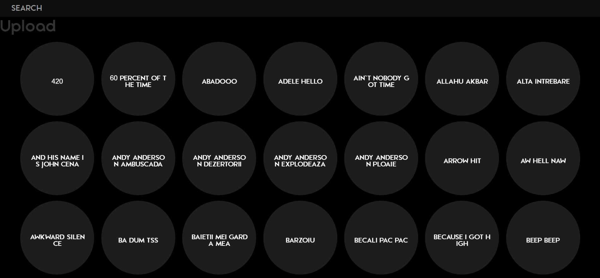

**Welcome To The Buttons!**

I put a couple of .mp3 sounds in the audio folder so that you can test the concept and see if you like it.

**I do not own any of the sounds included!**

*This project uses PHP and Javascript + Jquery( these loaded from CND automatically), so make sure that you have these dependencies installed before attempting to use it*

 - The upload feature is disabled by default. You must uncomment the PHP logic and the HTML code to make it available. After closing the upload modal, a JS window.replace will redirect the user to the site (to avoid the annoying submit again warning), don`t forget to uncomment it and put your own url there!
 - Don`t forget to give the OS user write permission to the approve folder or an error will be generated
 - Change the email in the upload function to your own or comment it out if you don`t want it
 
**The .mp3 Files go in the audio folder!**

**How do I make my own cool sounds?**

1. Install [Audacity](http://www.audacityteam.org/) 
2. Install llame library for audacity (this let`s you export recorded sounds to mp3) [Link](http://old.audacityteam.org/help/faq_i18n?s=install&i=lame-mp3&lang=hu)
3. Set audacity to record the output from your computer [Link](http://manual.audacityteam.org/man/tutorial_recording_computer_playback_on_windows.html)
4. Play the sound while you record it
5. Put a fade out effect on the last second of the sound (It makes for a more organic feeling when pushing the button)
6. Boost the sound with the equalizer effect. This is good for mobile users because phone speakers suck, so the sound needs to be loud
7. Put the .mp3 file in the audio/ folder

If you think this project is cool and you have any tips or ideas, please contact me at tudorjamal@gmail.com :)

Last but not least, I would like to thank [Andrei Susanu](https://github.com/andreisusanu), [Mihai Tuhari](https://github.com/mihaituhari) and [Alexandru Ifrim](https://github.com/aifrim) for coaching me and introducing me to the world of programming :D
